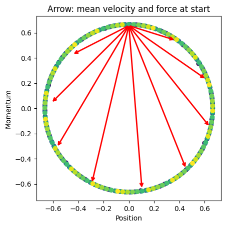

<h1 align="center">Learning Hamiltonian Flow Maps: Mean Flow Consistency for Large-Timestep Molecular Dynamics</h1>
<p align="center">
<a href="https://arxiv.org/abs/2601.22123"></a>
<a href="https://ml4molsim.github.io/hamiltonian-flow-maps/"></a>
<a href="https://colab.research.google.com/github/ML4MolSim/hamiltonian-flow-maps/blob/main/examples/harmonic_oscillator_standalone.ipynb"></a>
<a href="https://colab.research.google.com/github/ML4MolSim/hamiltonian-flow-maps/blob/main/examples/harmonic_oscillator_standalone_pytorch.ipynb"></a>
</p>
This repository implements learning <b>Hamiltonian Flow Maps (HFM)</b> for molecular dynamics simulations and other Hamiltonian systems.

<br/>
<br/>

<p align="center">
  
</p>

<p align="center">
  <em>Our learned Hamiltonian Flow Map enables stable simulations at significantly larger timesteps (right) than standard Velocity Verlet integration (left), which becomes inaccurate or unstable already at comparatively small step sizes. Consequently, our model explores conformational space more rapidly and identifies all relevant modes more efficiently than the baseline. </em>
</p>

## Project Structure

* **`configs/`**: Hydra configuration files for models and simulation environments.
* **`hfm/`**: Core library source code, including the main application scripts.
* **`tests/`**: Unit tests for simulations and conservation filters.
* **`examples/`**: Minimal working examples for toy potentials and simple systems.

## Installation

All required dependencies are managed via `pyproject.toml`. It is recommended to use **uv** for fast environment setup:

```bash
# Clone the repository and navigate to the root
cd hfm

# Setup the environment and verify installation
uv run python -c "import hfm; print('Setup successful')"
```

## Short intro

See our [standalone toy example](examples/harmonic_oscillator_standalone.ipynb) for a quick intro into training and evaluating Hamiltonian Flow Maps, and a [toy example with our code infrastructure](examples/harmonic_oscillator.ipynb).


<p align="center">
  
</p>

## Datasets

MD17 datasets can be downloaded directly from the [SGDML website](https://www.sgdml.org/#datasets).
The gravity dataset can be generated using the potential we provide or the original [SEGNN code base](https://github.com/RobDHess/Steerable-E3-GNN/blob/main/nbody/dataset/generate_dataset.py).

## Training Models

To train a new model, edit the parameters in `configs/config.yaml` and start a single run from the `hfm` subdirectory:

```bash
cd hfm
uv run python app.py
```

You can use our custom resolvers for ASE units directly in all Hydra configs. 
For example, to define a duration of 0.1 nanoseconds in ASE units use: `${ns:0.1}`


## Running Simulations

Simulations are managed via `simbench.py`. 
Use the configuration files in configs/simbench.yaml to define your environment (integrators like NVE/NVT and simulation filters).

```bash
cd hfm
uv run python simbench.py
```

- Use sim_env/{your_config_file} to specify a simulation environment consisting of integrators and simulation filters.
- The main config (simbench.yaml) can be adapted to add/remove logged metrics or adjust constants.
- In simbench.yaml, specify the HFM model path and the path to the force field for energy correction.

## Testing

Use discover on the test directory to run all tests (run command from root directory):

```bash
uv run python -m unittest discover tests/
```

Alternatively run a single test using:
```bash
uv run python -m unittest tests/test_nvt_simulation.py
```

## Contributing

Feel free to open an issue if you encounter any problems or have questions.

## Citation

If you find our work useful, please cite:

```
@article{ripken2026learning,
    title = {Learning Hamiltonian Flow Maps: Mean Flow Consistency for Large-Timestep Molecular Dynamics},
    author = {Ripken, Winfried and Plainer, Michael and Lied, Gregor and Frank, Thorben and Unke, Oliver T. and Chmiela, Stefan and No{\'e}, Frank and M{\"u}ller, Klaus Robert},
    year = {2026},
    journal={arXiv preprint arXiv:2601.22123},
}
```